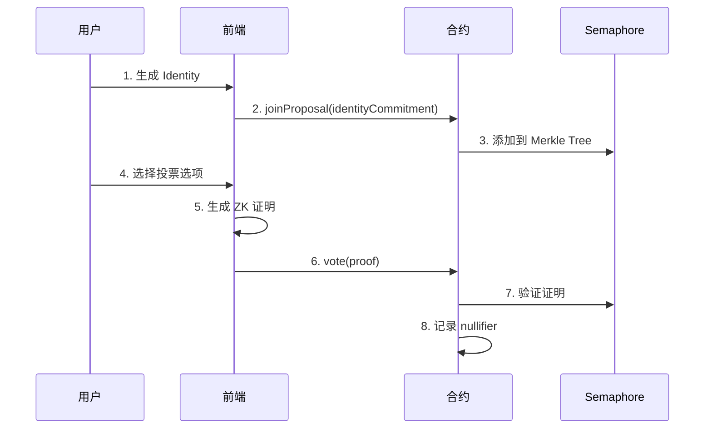

# UUPS_SimpleVote - 基于 ZK-SNARK 的匿名投票系统

> **作者**: Sue | **版本**: v7.0 | **更新日期**: 2025-12-27

[](https://book.getfoundry.sh/)
[](https://soliditylang.org/)
[](./LICENSE)

---

## 🎯 项目概述

**UUPS_SimpleVote** 是一个基于 **Semaphore 协议** 的匿名投票系统，采用 **ZK-SNARK** 零知识证明技术实现完全匿名投票。项目使用 **UUPS 可升级代理模式**，支持合约平滑升级。

### ✨ 核心特性

| 特性 | 描述 |
|------|------|
| 🔐 **完全匿名** | 基于 ZK-SNARK，无法追踪投票者身份 |
| 🛡️ **防重复投票** | Nullifier 机制防止双重投票 |
| ⚡ **可升级架构** | UUPS 代理模式，支持无缝升级 |
| 🌳 **Merkle Tree** | 群组成员管理，高效身份验证 |
| 📚 **教学友好** | 完整文档，适合 ZK 技术学习 |

---

## 🏗️ 技术架构

### 智能合约栈

- **Solidity** ^0.8.26 - 智能合约开发语言
- **Foundry** - 现代化 Solidity 开发框架
- **OpenZeppelin** - 可升级合约基础库
- **Semaphore Protocol** - ZK 身份验证与证明系统

### 合约版本演进

```
V1 → V2 → V3 → V4 → V5 → V6 → V7 (当前)
│         │               │     │
│         │               │     └── 独立树方案 (教学优化)
│         │               └── 共享树完整功能版
│         └── 增加选项票数统计
└── 基础匿名投票
```

### 目录结构

```
UUPS_SimpleVote/
├── src/                          # 智能合约源码
│   ├── SimpleVotingV7.sol        # 最新版本 (独立树方案)
│   ├── SimpleVotingV6.sol        # 功能完整版 (共享树)
│   └── ...                       # 历史版本
├── script/                       # 部署与升级脚本
│   ├── DeployCleanV7.s.sol       # 全新部署 V7
│   ├── UpgradeToV7.s.sol         # 升级到 V7
│   └── ...
├── test/                         # 测试文件
│   ├── SimpleVotingV7.t.sol      # V7 测试套件
│   └── ...
├── circuits/                     # ZK 电路 (Circom)
│   └── vote.circom               # 投票证明电路
├── docs/                         # 详细文档
│   ├── frontend-design.md        # 前端设计
│   ├── 合约实施方案.md            # 技术实现
│   └── ...
└── lib/                          # 依赖库
    ├── semaphore/                # Semaphore 协议
    └── openzeppelin-contracts/   # OpenZeppelin
```

---

## 🚀 快速开始

### 环境要求

- [Foundry](https://book.getfoundry.sh/) (forge, cast, anvil)
- Node.js >= 18.0 (用于前端集成)

### 安装

```bash
# 克隆项目
git clone <your-repo-url>
cd UUPS_SimpleVote

# 安装依赖
forge install

# 编译合约
forge build
```

### 本地开发

```bash
# 启动本地测试网
anvil

# 部署到本地 (新终端)
forge script script/DeployCleanV7.s.sol --rpc-url http://127.0.0.1:8545 --broadcast

# 运行测试
forge test -vvv
```

### 部署到测试网

```bash
# 配置环境变量
cp .env.example .env
# 编辑 .env 填入 PRIVATE_KEY 和 RPC_URL

# 部署到 Sepolia
source .env
forge script script/DeployCleanV7.s.sol \
  --rpc-url $SEPOLIA_RPC \
  --broadcast \
  --verify \
  -vvvv
```

---

## 📊 V6 vs V7 对比

项目提供两个主要版本供不同场景使用：

| 维度 | V6 (共享树) | V7 (独立树) |
|------|-------------|-------------|
| **定位** | 功能完整的生产系统 | 教学演示极简系统 |
| **隐私级别** | ⚠️ 链上可见选项 | ✅ 完全隐私 |
| **票数统计** | ✅ 实时统计 | ❌ 不统计 |
| **Gas 成本** | ~180K gas/vote | ~100K (-44%) ✅ |
| **Merkle Tree** | 共享群组树 | 用户独立树 |
| **证明生成** | 较慢 (大树) | 极快 ✅ |

> 📖 详细对比请参阅 [V6_VS_V7_COMPARISON.md](./V6_VS_V7_COMPARISON.md)

---

## 📚 文档导航

### 核心文档

| 文档 | 描述 |
|------|------|
| [docs/README.md](./docs/README.md) | 文档中心目录 |
| [docs/frontend-design.md](./docs/frontend-design.md) | 前端设计方案 |
| [docs/合约实施方案.md](./docs/合约实施方案.md) | 合约架构设计 |
| [V6_VS_V7_COMPARISON.md](./V6_VS_V7_COMPARISON.md) | 版本对比详解 |
| [V7_UPGRADE_GUIDE.md](./V7_UPGRADE_GUIDE.md) | V7 升级指南 |

### ZK 技术文档

| 文档 | 描述 |
|------|------|
| [Semaphore匿名原理详解.md](./Semaphore匿名原理详解.md) | Semaphore 协议原理 |
| [MerkleTree_方案对比.md](./MerkleTree_方案对比.md) | 共享树 vs 独立树分析 |
| [circuits/README.md](./circuits/README.md) | ZK 电路说明 |

---

## 📦 已部署合约

### Sepolia 测试网

| 合约 | 地址 |
|------|------|
| **代理合约 (使用这个)** | `0xEA22e17ABD5D2fd53dF911Bb21cA861ecdBa2436` |
| SemaphoreVerifier | `0xDfc4C8454623995346701fde6D288f64dA67Ec11` |
| Semaphore | `0xd4122b4ddf7B9832F73c728B1E9157409B071380` |

🔍 [在 Etherscan 上查看](https://sepolia.etherscan.io/address/0xEA22e17ABD5D2fd53dF911Bb21cA861ecdBa2436)

---

## 🛠️ 常用命令

### 构建与测试

```bash
# 编译合约
forge build

# 运行测试
forge test

# 带详细输出的测试
forge test -vvvv

# Gas 报告
forge test --gas-report
```

### 格式化与分析

```bash
# 代码格式化
forge fmt

# Gas 快照
forge snapshot

# 查看合约大小
forge build --sizes
```

### 本地节点

```bash
# 启动 Anvil 本地节点
anvil

# 带自定义配置
anvil --chain-id 31337 --accounts 10
```

### 交互

```bash
# 调用合约方法
cast call $PROXY_ADDRESS "version()" --rpc-url $RPC_URL

# 发送交易
cast send $PROXY_ADDRESS "createProposal(string)" "Test Proposal" \
  --rpc-url $RPC_URL \
  --private-key $PRIVATE_KEY
```

---

## 🔄 投票流程



---

## 💰 Gas 费用参考

| 操作 | Gas 消耗 | 费用估算 (Sepolia) |
|------|----------|-------------------|
| createProposal | ~95,000 | ~0.0001 ETH |
| addOption | ~48,000 | ~0.00005 ETH |
| joinProposal | ~120,000 | ~0.00012 ETH |
| vote (V7) | ~100,000 | ~0.0001 ETH |
| vote (V6) | ~180,000 | ~0.00018 ETH |

---

## 🤝 贡献

欢迎提交 Issue 和 Pull Request！

### 开发建议

- 添加更多测试覆盖
- 优化 Gas 消耗
- 改进文档和示例
- 前端 SDK 封装

---

## 📄 许可证

[MIT License](./LICENSE)

---

## 📞 联系方式

- **作者**: Sue
- **GitHub**: [Im-Sue](https://github.com/Im-Sue/)
- **Telegram**: @Sue_muyu

---

## 🔗 相关资源

- [Foundry 文档](https://book.getfoundry.sh/)
- [Semaphore 协议](https://semaphore.pse.dev/)
- [OpenZeppelin 可升级合约](https://docs.openzeppelin.com/upgrades/)
- [Circom 教程](https://docs.circom.io/)
